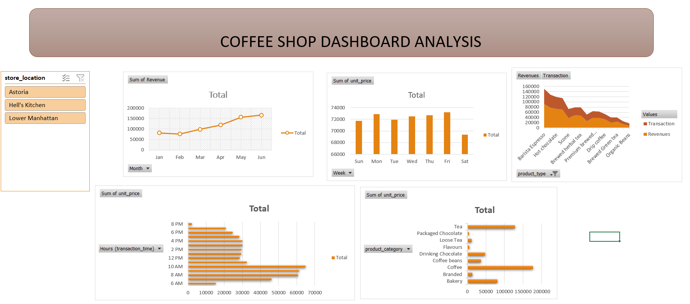
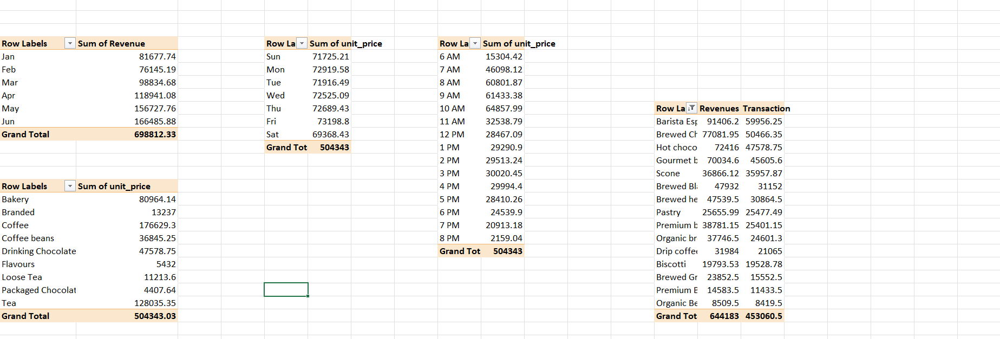

# ☕ Coffee Shop Sales Dashboard (Microsoft Excel)

## 📌 Project Overview

This project analyzes transactional sales data from a coffee shop using **Microsoft Excel**. The dashboard was built using Pivot Tables, Pivot Charts, calculated columns, slicers, and interactive visualizations to uncover sales trends, customer purchasing behavior, and product performance.

The objective was to transform raw transaction data into an interactive business dashboard that helps management make data-driven decisions.

---

## 🎯 Project Objectives

- Analyze coffee shop transaction data.
- Calculate revenue for every transaction.
- Identify monthly sales trends.
- Analyze customer purchasing patterns by weekday and hour.
- Determine best-selling product categories and products.
- Build an interactive dashboard using Excel.

---

## 📂 Dataset

The dataset contains individual sales transactions including:

- Transaction Date
- Transaction Time
- Store Location
- Product Category
- Product Type
- Product Detail
- Unit Price
- Quantity Sold

---

## 🛠 Tools Used

- Microsoft Excel
- Pivot Tables
- Pivot Charts
- Slicers
- Calculated Columns
- Excel Formulas
- Dashboard Design

---

## 📊 Data Preparation

The following calculated columns were created:

### Revenue

```excel
=Unit Price * Quantity
```

### Month

```excel
=TEXT(Transaction Date,"mmm")
```

### Day of Week

```excel
=TEXT(Transaction Date,"ddd")
```

### Hour

```excel
=HOUR(Transaction Time)
```

---

## 📈 Dashboard Features

The dashboard includes:

- 📅 Monthly Revenue Trend (Line Chart)
- 📆 Transactions by Day of Week (Column Chart)
- ⏰ Transactions by Hour of Day (Column Chart)
- ☕ Transactions by Product Category (Bar Chart)
- 🥤 Top 15 Product Types by Transactions and Revenue
- 📍 Interactive Store Location Slicer
- Fully dynamic PivotTable connections

---

## 📋 Pivot Table Analysis

### Revenue by Month
- Displays monthly revenue trends.
- Helps identify seasonal demand.

### Transactions by Day of Week
- Shows busiest weekdays.
- Useful for workforce planning.

### Transactions by Hour
- Identifies peak business hours.
- Helps optimize staffing and inventory.

### Product Category Analysis
- Displays transaction volume across product categories.
- Highlights the most popular product groups.

### Top 15 Product Types
- Shows highest-selling products.
- Includes both transaction count and revenue.

---

## 📌 Business Insights

Some key insights obtained from the dashboard include:

- Revenue varies across months, indicating seasonal purchasing behavior.
- Morning hours generate the highest transaction volume.
- Weekdays generally outperform weekends.
- Beverage products contribute the majority of transactions.
- A small number of products generate a significant share of revenue.

---

## 💡 Recommendations

- Increase staffing during peak morning hours.
- Ensure sufficient inventory for top-selling beverages.
- Launch promotions during low-traffic periods.
- Bundle high-performing products with slower-selling items.
- Monitor store-wise performance using slicers to optimize operations.

---

## ## 📷 Dashboard Preview



## ## 📷 Dashboard Preview


Example:

```
images/dashboard.png
```
## ## 📷 Dashboard Preview


Example:

---
images/dashboard.png
```
## 📁 Project Structure

```
Coffee-Shop-Sales-Dashboard/
│
├── Coffee Shop Sales Dashboard.xlsx
├── Dashboard Screenshot.png
├── README.md
└── images/
    └── dashboard.png
```

---

## 🚀 Skills Demonstrated

- Data Cleaning
- Excel Formulas
- Pivot Tables
- Pivot Charts
- Dashboard Design
- Business Intelligence
- Data Visualization
- Sales Analysis
- Interactive Reporting

---

## 📬 Contact

**Vikas Pradhan**

- GitHub: https://github.com/YourUsername
- LinkedIn: https://linkedin.com/in/YourProfile

---

⭐ If you found this project helpful, feel free to star the repository!
